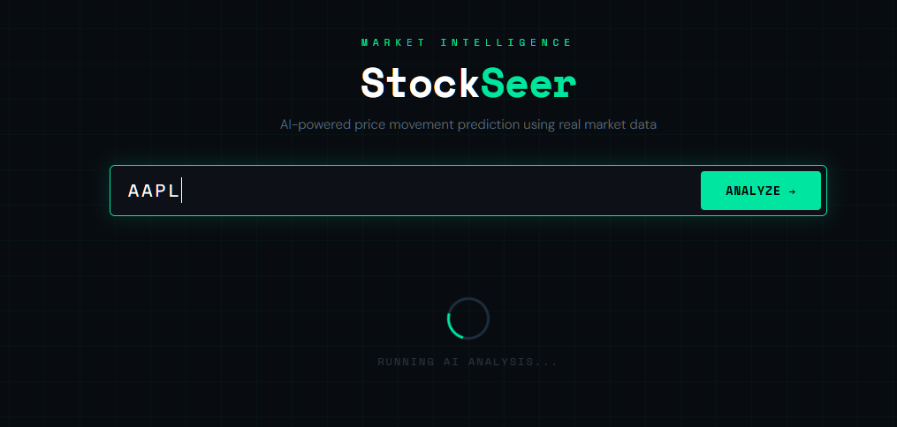
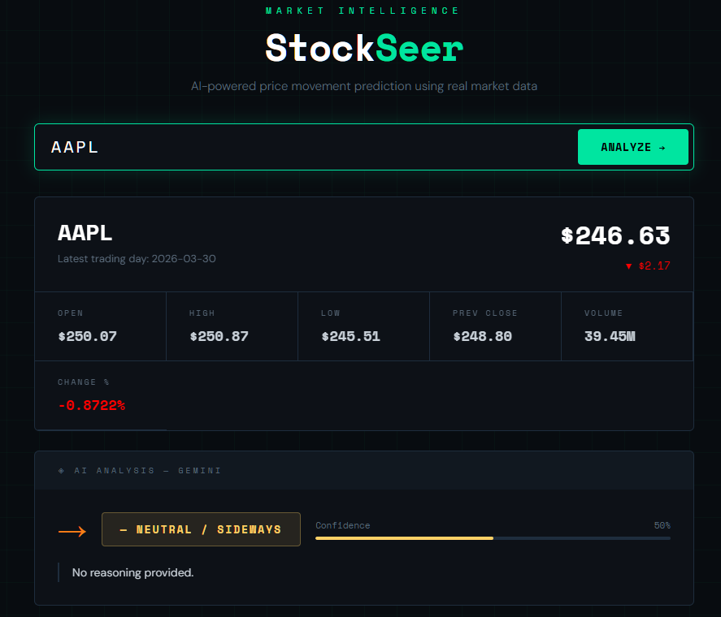
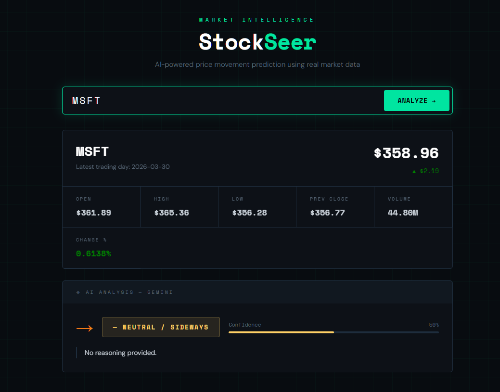

# StockSeer — AI Stock Price Predictor 📈🤖

StockSeer is a web application that predicts short-term stock price movements using **real-time market data** from **Alpha Vantage** and AI analysis via **Google Gemini**. It provides a simple, modern interface for traders, investors, or anyone curious about stock trends.

---

## Features ✨

- Fetch real-time stock data for any ticker (AAPL, TSLA, MSFT, etc.)
- View essential market stats:
  - Current Price, Open, High, Low
  - Previous Close, Volume, Change & Change %
- AI-powered prediction using **Google Gemini API**
  - Predicts **UP**, **DOWN**, or **NEUTRAL**
  - Shows **confidence percentage**
  - Provides short **reasoning/explanation**
- Responsive and modern UI with interactive confidence bar
- Handles errors gracefully (invalid ticker, network errors, rate limits)

---

## Screenshot 🖼️

  



---

## Usage 📌

1. Clone or download the repository.
2. Open `index.html` in your browser.
3. Enter a stock ticker symbol (e.g., `AAPL`, `TSLA`) in the search box.
4. Click **ANALYZE →** or press **Enter**.
5. View the stock data and AI prediction.
6. Confidence bars indicate the AI's confidence in the predicted direction.

---

## API Configuration ⚙️

1. Sign up for **[Alpha Vantage](https://www.alphavantage.co/)** and get a free API key.
2. Sign up for **[Google Gemini](https://ai.google.com/)** and get a free API key.
3. Add your keys in `app.js`:

```javascript
const ALPHA_VANTAGE_KEY = "YOUR_ALPHA_VANTAGE_KEY";
const GEMINI_API_KEY = "YOUR_GOOGLE_GEMINI_KEY";
const GEMINI_MODEL = "gemini-2.5-flash-lite"; // recommended free-tier model
```
